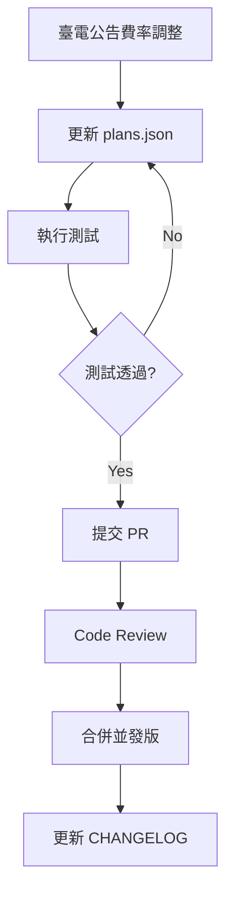

# 臺電時間電價比較網站 - 技術規格書
## Taipower TOU Comparison Website - Technical Specification Document

---

**Version:** 1.0.0
**Date:** 2025-02-21
**Status:** Draft
**Author:** Technical Specification Team

---

## Table of Contents

1. [專案概述 (Project Overview)](#1-專案概述-project-overview)
2. [目標與範圍 (Goals and Scope)](#2-目標與範圍-goals-and-scope)
3. [技術架構 (Technical Architecture)](#3-技術架構-technical-architecture)
4. [功能需求 (Functional Requirements)](#4-功能需求-functional-requirements)
5. [非功能需求 (Non-Functional Requirements)](#5-非功能需求-non-functional-requirements)
6. [資料模型 (Data Models)](#6-資料模型-data-models)
7. [核心模組設計 (Core Module Design)](#7-核心模組設計-core-module-design)
8. [使用者介面設計 (User Interface Design)](#8-使用者介面設計-user-interface-design)
9. [實作細節 (Implementation Details)](#9-實作細節-implementation-details)
10. [測試計畫 (Testing Plan)](#10-測試計畫-testing-plan)
11. [部署策略 (Deployment Strategy)](#11-部署策略-deployment-strategy)
12. [維護與演進 (Maintenance and Evolution)](#12-維護與演進-maintenance-and-evolution)
13. [風險評估 (Risk Assessment)](#13-風險評估-risk-assessment)
14. [附錄 (Appendix)](#14-附錄-appendix)

---

## 1. 專案概述 (Project Overview)

### 1.1 專案背景

臺電（臺灣電力公司）提供多種電價方案，包括傳統累進費率和時間電價（Time-of-Use, TOU）方案。許多使用者不瞭解不同方案下的電費差異，可能選擇了不適合自己用電習慣的方案，導致不必要的電費支出。

本專案旨在開發一個**純前端的網頁應用程式**，讓使用者可以：
1. 拍照或上傳電費單
2. 自動識別電費單上的關鍵資訊
3. 計算各種電價方案下的電費
4. 比較不同方案的差異
5. 提供省錢建議

### 1.2 現狀分析

**現有系統 (taipower-tou-web)**
- 採用 FastAPI 後端 + React 前端的雙層架構
- 功能：上傳 CSV 檔案 → 計算不同費率方案的電費
- 限制：
  - 需要後端伺服器執行
  - 使用者需準備 CSV 格式的用電資料
  - 無法直接處理電費單

**痛點**
- 一般使用者沒有 CSV 格式的用電資料
- 電費單是最容易取得的用電資料來源
- 需要部署後端，增加維護成本

### 1.3 解決方案概述

**新的系統設計**
- **純前端架構**：使用 React + TypeScript，可部署至 GitHub Pages
- **OCR 技術**：使用 Tesseract.js 進行瀏覽器端文字識別
- **電費單解析**：從臺電紙本電費單照片中提取關鍵資訊
- **費率計算引擎**：移植 Python taipower-tou 套件的邏輯到 TypeScript
- **方案比較**：顯示各種費率方案下的電費差異

**技術亮點**
- 完全在瀏覽器端執行，無需後端伺服器
- 使用者資料不上傳至任何伺服器，保護隱私
- 零成本部署（GitHub Pages）
- 支援行動裝置拍照上傳

---

## 2. 目標與範圍 (Goals and Scope)

### 2.1 專案目標

| 目標類別 | 具體目標 | 成功指標 (KPI) |
|----------|----------|----------------|
| **功能目標** | OCR 識別準確率 ≥ 80% | 測試集正確識別率 |
| **功能目標** | 支援 20 種臺電費率方案計算 | 方案覆蓋率 100% |
| **功能目標** | 電費計算誤差 < 1% | 與臺電官方計算結果比對 |
| **技術目標** | 純前端架構 | 無後端依賴 |
| **技術目標** | 部署至 GitHub Pages | 可公開訪問 |
| **使用者體驗** | 從上傳到結果 < 30 秒 | 端到端處理時間 |
| **使用者體驗** | 支援行動裝置 | 響應式設計 |

### 2.2 功能範圍

#### 包含功能

| 模組 | 功能描述 | 優先順序 |
|------|----------|--------|
| **電費單上傳** | 支援拍照、選擇圖片、拖曳上傳 | P0 |
| **OCR 識別** | 識別電費單上的關鍵欄位 | P0 |
| **欄位編輯** | 允許使用者手動修正識別結果 | P0 |
| **費率計算** | 計算所有可用費率方案的電費 | P0 |
| **結果比較** | 顯示各方案的電費與差異 | P0 |
| **省錢建議** | 推薦最省錢的方案 | P1 |
| **圖表展示** | 使用圖表視覺化比較結果 | P1 |
| **歷史記錄** | 本地儲存查詢記錄 | P2 |
| **分享功能** | 產生分享連結或圖片 | P2 |

#### 不包含功能

- 使用者帳號系統
- 電費單資料雲端儲存
- 自動從臺電系統抓取電費資料
- 電力使用即時監控
- 預測未來電費

### 2.3 非範圍專案

- 不處理非臺電電費單
- 不支援 PDF 格式電費單（僅支援圖片格式）
- 不提供專業諮詢服務
- 不保證 OCR 識別結果 100% 正確

---

## 3. 技術架構 (Technical Architecture)

### 3.1 系統架構圖

```
┌─────────────────────────────────────────────────────────────────────────────┐
│                           使用者瀏覽器 (Browser)                              │
│                                                                              │
│  ┌──────────────┐      ┌──────────────┐      ┌──────────────┐              │
│  │   UI Layer   │      │  OCR Module  │      │  Calculation │              │
│  │              │      │              │      │    Engine    │              │
│  │  - React     │◄────►│  Tesseract.js│◄────►│  TypeScript  │              │
│  │  - TypeScript│      │  (Chinese)   │      │  - Rate Data │              │
│  │  - Recharts  │      │              │      │  - Logic     │              │
│  └──────────────┘      └──────────────┘      └──────────────┘              │
│         ▲                                              │                    │
│         │                                              ▼                    │
│  ┌──────────────┐                              ┌──────────────┐           │
│  │   State      │                              │   Data       │           │
│  │  Management  │                              │   Storage    │           │
│  │   Zustand    │                              │  plans.json  │           │
│  └──────────────┘                              │  LocalStorage│           │
│                                                 └──────────────┘           │
└─────────────────────────────────────────────────────────────────────────────┘
                                         │
                                         │ HTTP/HTTPS
                                         ▼
┌─────────────────────────────────────────────────────────────────────────────┐
│                        GitHub Pages (Static Hosting)                         │
│                                                                              │
│  - index.html        - assets/                                               │
│  - *.js bundles      - images/                                               │
│  - *.css             - plans.json                                            │
│                                                                              │
└─────────────────────────────────────────────────────────────────────────────┘
```

### 3.2 技術堆疊

#### 前端框架

| 類別 | 技術選擇 | 版本 | 用途 |
|------|----------|------|------|
| **框架** | React | 19.x | UI 元件建構 |
| **語言** | TypeScript | 5.x | 型別安全 |
| **建置工具** | Vite | 5.x | 快速開發與打包 |
| **狀態管理** | Zustand | 4.x | 輕量級狀態管理 |

#### UI 與視覺化

| 類別 | 技術選擇 | 版本 | 用途 |
|------|----------|------|------|
| **圖表庫** | Recharts | 2.x | 資料視覺化 |
| **樣式** | Tailwind CSS | 3.x | 響應式設計 |
| **圖示** | Lucide React | latest | 圖示元件 |

#### OCR 與資料處理

| 類別 | 技術選擇 | 版本 | 用途 |
|------|----------|------|------|
| **OCR** | Tesseract.js | 5.x | 文字識別 |
| **圖片處理** | Canvas API | native | 圖片預處理 |
| **資料解析** | 自行實作 | - | 電費單欄位提取 |

#### 工具與測試

| 類別 | 技術選擇 | 版本 | 用途 |
|------|----------|------|------|
| **測試框架** | Vitest | 1.x | 單元測試 |
| **E2E 測試** | Playwright | 1.x | 端到端測試 |
| **程式碼品質** | ESLint | 9.x | Linting |
| **型別檢查** | TypeScript | 5.x | 型別檢查 |
| **格式化** | Prettier | 3.x | 程式碼格式化 |

### 3.3 資料流程圖

```
┌───────────┐     ┌──────────────┐     ┌──────────────┐
│  使用者   │────►│  上傳電費單   │────►│  圖片預處理  │
│           │     │              │     │  (壓縮/旋轉) │
└───────────┘     └──────────────┘     └──────┬───────┘
                                              │
                                              ▼
                                        ┌──────────────┐
                                        │  Tesseract.js│
                                        │  OCR 識別    │
                                        └──────┬───────┘
                                               │
                                               ▼
                                        ┌──────────────┐
                                        │  原始文字輸出 │
                                        └──────┬───────┘
                                               │
                                               ▼
                                        ┌──────────────┐
                                        │  欄位提取器  │
                                        │  (正規表示式)│
                                        └──────┬───────┘
                                               │
                                               ▼
                                        ┌──────────────┐     ┌───────────┐
                                        │  人工確認/   │────►│  最終資料  │
                                        │  修正欄位    │     │            │
                                        └──────────────┘     └─────┬─────┘
                                                                   │
                                                                   ▼
                                                            ┌──────────────┐
                                                            │  費率計算引擎│
                                                            │  (20種方案)  │
                                                            └──────┬───────┘
                                                                   │
                                                                   ▼
                                                            ┌──────────────┐
                                                            │  結果比較與  │
                                                            │  視覺化展示  │
                                                            └──────────────┘
```

---

## 4. 功能需求 (Functional Requirements)

### 4.1 核心功能

#### FR-1: 電費單上傳

| 需求 ID | 描述 | 驗收標準 |
|---------|------|----------|
| FR-1.1 | 支援選擇本機圖片上傳 | 可選擇 JPG/PNG 格式圖片 |
| FR-1.2 | 支援裝置拍照功能 | 行動裝置可呼叫相機 |
| FR-1.3 | 支援拖曳上傳 | 可拖曳圖片至指定區域 |
| FR-1.4 | 圖片預覽 | 上傳後顯示圖片預覽 |
| FR-1.5 | 圖片大小限制 | 最大 10MB |
| FR-1.6 | 圖片格式驗證 | 拒絕非圖片格式檔案 |

#### FR-2: OCR 識別

| 需求 ID | 描述 | 驗收標準 |
|---------|------|----------|
| FR-2.1 | 載入 Tesseract.js 引擎 | 載入繁體中文語言包 |
| FR-2.2 | 執行文字識別 | 返回識別的文字內容 |
| FR-2.3 | 識別進度顯示 | 顯示載入與識別進度 |
| FR-2.4 | 識別錯誤處理 | 識別失敗時顯示錯誤訊息 |

#### FR-3: 電費單欄位提取

| 需求 ID | 描述 | 驗收標準 |
|---------|------|----------|
| FR-3.1 | 提取使用者名稱稱 | 正規表示式匹配使用者名稱 |
| FR-3.2 | 提取電號 | 正規表示式匹配 8-10 位數字 |
| FR-3.3 | 提取計費期間 | 識別起迄日期 |
| FR-3.4 | 提取用電度數 | 識別「本期度數」欄位 |
| FR-3.5 | 提取電費金額 | 識別「電費小計」或「應繳總額」 |
| FR-3.6 | 提取當前方案 | 識別「電價方案」欄位 |
| FR-3.7 | 識別尖峰/離峰度數 | 若有時間電價，分別提取 |

#### FR-4: 費率計算

| 需求 ID | 描述 | 驗收標準 |
|---------|------|----------|
| FR-4.1 | 累進費率計算 | 實作 Residential Non-TOU 方案 |
| FR-4.2 | 兩段式時間電價 | 實作 Residential Simple 2-Tier 方案 |
| FR-4.3 | 三段式時間電價 | 實作 Residential Simple 3-Tier 方案 |
| FR-4.4 | 基本電費計算 | 依據契約容量計算基本電費 |
| FR-4.5 | 流動電費計算 | 依據用電度數與時間計算 |
| FR-4.6 | 季節係數 | 夏季/非夏季不同費率 |
| FR-4.7 | 用電型別判斷 | 低壓/高壓、單相/三相 |

#### FR-5: 結果比較與展示

| 需求 ID | 描述 | 驗收標準 |
|---------|------|----------|
| FR-5.1 | 方案列表展示 | 顯示所有可用方案 |
| FR-5.2 | 電費金額排序 | 依電費由低至高排序 |
| FR-5.3 | 差異金額顯示 | 顯示與當前方案的差異 |
| FR-5.4 | 節省百分比 | 顯示可節省的百分比 |
| FR-5.5 | 圖表視覺化 | 使用長條圖比較各方案 |
| FR-5.6 | 詳細費率說明 | 展開檢視費率細節 |

### 4.2 使用者故事

#### US-1: 上傳並檢視結果

```
作為 一般使用者
我想要 拍照上傳我的電費單
以便 快速瞭解是否有更省錢的電價方案

驗收標準：
- 可以使用相機拍照
- 可以選擇相簿中的照片
- 上傳後自動開始識別
- 識別完成後顯示結果
```

#### US-2: 修正識別結果

```
作為 一般使用者
我想要 手動修正 OCR 識別錯誤的欄位
以便 確保計算結果正確

驗收標準：
- 識別結果可編輯
- 標示識別信心度低的欄位
- 修正後可重新計算
```

#### US-3: 瞭解方案差異

```
作為 一般使用者
我想要 檢視不同方案的電費差異
以便 決定是否要更換方案

驗收標準：
- 清楚顯示各方案電費
- 標示最省錢的方案
- 顯示可節省的金額
- 提供方案切換建議
```

#### US-4: 手動輸入資料

```
作為 一般使用者
我想要 手動輸入用電資料
以便 在 OCR 失敗時仍可使用

驗收標準：
- 提供手動輸入表單
- 必填欄位驗證
- 與 OCR 結果無縫切換
```

### 4.3 功能優先順序

#### P0 - 必須實作 (MVP)

1. 電費單圖片上傳
2. OCR 文字識別
3. 基本欄位提取（度數、期間）
4. 至少 5 種常用方案計算
5. 結果列表顯示

#### P1 - 重要功能

6. 欄位手動修正
7. 完整 20 種方案計算
8. 圖表視覺化
9. 省錢建議
10. 手動輸入模式

#### P2 - 增值功能

11. 歷史記錄
12. 分享功能
13. 多種電費單格式支援
14. 深色模式

---

## 5. 非功能需求 (Non-Functional Requirements)

### 5.1 效能需求

| 指標 | 目標值 | 測量方法 |
|------|--------|----------|
| **首頁載入時間** | < 3 秒 | Lighthouse Performance Score |
| **OCR 識別時間** | < 20 秒 | 從上傳到識別完成 |
| **計算時間** | < 500ms | 所有方案計算完成 |
| **頁面互動延遲** | < 100ms | 使用者操作到回應 |
| **記憶體使用** | < 200MB | Tesseract.js 載入後 |
| **套件大小** | < 2MB (gzipped) | 打包後的 JavaScript |

### 5.2 安全需求

| 需求 | 描述 | 實作方式 |
|------|------|----------|
| **資料隱私** | 使用者資料不上傳到伺服器 | 純前端處理 |
| **XSS 防護** | 防止跨站指令碼攻擊 | React 自動轉義 + CSP |
| **HTTPS** | 強制使用 HTTPS | GitHub Pages 自動啟用 |
| **輸入驗證** | 驗證所有使用者輸入 | TypeScript 型別檢查 |
| **第三方套件** | 定期更新相依套件 | Dependabot 自動更新 |

### 5.3 可用性需求

| 需求 | 描述 | 實作方式 |
|------|------|----------|
| **響應式設計** | 支援手機、平板、桌面 | Tailwind CSS 響應式類 |
| **無障礙** | 符合 WCAG 2.1 AA | ARIA 屬性、鍵盤導航 |
| **多語言** | 支援繁體中文 | i18n 或直接硬體中文 |
| **錯誤提示** | 清楚的錯誤訊息 | 使用者友善的錯誤訊息 |
| **離線支援** | 基本離線功能 | Service Worker (可選) |

### 5.4 相容性需求

| 類別 | 需求 |
|------|------|
| **瀏覽器** | Chrome 90+, Safari 14+, Firefox 88+, Edge 90+ |
| **行動裝置** | iOS 14+, Android 10+ |
| **螢幕尺寸** | 320px - 2560px 寬度 |
| **JavaScript** | ES2020+ 支援 |

---

## 6. 資料模型 (Data Models)

### 6.1 費率資料結構

```typescript
/**
 * 費率方案資料結構
 * Source: taipower-tou/src/taipower_tou/data/plans.json
 */

interface Season {
  name: 'summer' | 'non_summer';
  start: string;  // "06-01" (MM-DD format)
  end: string;    // "09-30"
}

interface Period {
  name: 'peak' | 'semi_peak' | 'off_peak' | 'flat';
}

interface DayType {
  name: 'weekday' | 'saturday' | 'sunday_holiday';
}

interface TimeSlot {
  period: Period;
  start: string;  // "HH:MM"
  end: string;    // "HH:MM"
}

interface EnergyChargeRate {
  period: Period;
  rate: number;  // 元/kWh
}

interface BasicChargeRate {
  voltage_type: 'low_voltage' | 'high_voltage';
  phase: 'single' | 'three';
  capacity_range: {
    min: number;
    max: number | null;
  };
  summer_rate: number;
  non_summer_rate: number;
}

interface TierRate {
  tier: number;
  min_kwh: number;
  max_kwh: number | null;
  rate: number;  // 元/kWh
}

interface Plan {
  id: string;                    // e.g., "residential_non_tou"
  name: string;                  // e.g., "住家用電（非時間電價）"
  name_en: string;               // e.g., "Residential (Non-TOU)"
  type: 'residential' | 'lighting' | 'commercial';
  tou_type: 'none' | 'simple_2_tier' | 'simple_3_tier' | 'full_tou';
  voltage: 'low_voltage' | 'high_voltage';
  requires_meter: boolean;       // 是否需要特殊電錶
  minimum_consumption: number | null;

  // 費率資料
  basic_charges: BasicChargeRate[];
  energy_charges: {
    summer: EnergyChargeRate[];
    non_summer: EnergyChargeRate[];
  };

  // 時間電價專用
  time_slots?: {
    weekday: TimeSlot[];
    saturday: TimeSlot[];
    sunday_holiday: TimeSlot[];
  };

  // 累進費率專用
  tier_rates?: TierRate[];

  // 季節定義
  seasons: {
    summer: Season;
    non_summer: Season;
  };
}

interface PlansData {
  version: string;               // e.g., "20251001"
  definitions: {
    seasons: Season[];
    seasons_high_voltage: Season[];
    periods: Period[];
    day_types: DayType[];
  };
  plans: Plan[];
}
```

### 6.2 電費單資料結構

```typescript
/**
 * 電費單欄位資料結構
 * 從 OCR 識別結果中提取
 */

interface ElectricityBill {
  // 基本資訊
  customerName?: string;         // 使用者名稱稱
  accountNumber?: string;        // 電號 (8-10 位數字)

  // 計費期間
  billingPeriod: {
    startDate: Date;             // 計費起始日
    endDate: Date;               // 計費終止日
    days: number;                // 計費天數
  };

  // 用電資訊
  consumption: {
    previousReading: number;     // 上期度數
    currentReading: number;      // 本期度數
    usage: number;               // 用電度數 (kWh)
    multiplier: number;          // 倍數 (通常為 1)
  };

  // 當前方案與電費
  currentPlan?: {
    name: string;                // 當前方案名稱
    baseCharge: number;          // 基本電費
    energyCharge: number;        // 流動電費
    total: number;               // 應�總額
  };

  // 時間電價用電明細 (若有)
  touConsumption?: {
    peakOnPeak: number;          // 尖峰用電
    semiPeak: number;            // 半尖峰用電
    offPeak: number;             // 離峰用電
    total: number;               // 總用電
  };

  // OCR 識別資訊
  ocrMetadata: {
    confidence: number;          // 整體信心度 (0-1)
    fieldConfidences: {          // 各欄位信心度
      [key: string]: number;
    };
    processingTime: number;      // 處理時間 (ms)
  };
}

/**
 * 手動輸入的簡化版資料結構
 */
interface ManualConsumptionInput {
  billingPeriod: {
    month: number;               // 月份 (1-12)
    year: number;                // 年份
  };
  consumption: {
    peakOnPeak?: number;         // 尖峰用電 (可選)
    semiPeak?: number;           // 半尖峰用電 (可選)
    offPeak?: number;            // 離峰用電 (可選)
    total: number;               // 總用電 (必填)
  };
  voltageType: 'low_voltage' | 'high_voltage';
  phase: 'single' | 'three';
  contractCapacity?: number;     // 契約容量 (kW)
}
```

### 6.3 計算結果資料結構

```typescript
/**
 * 費率計算結果
 */
interface PlanCalculationResult {
  planId: string;
  planName: string;
  planNameEn: string;

  // 計算結果
  charges: {
    base: number;                // 基本電費
    energy: number;              // 流動電費
    total: number;               // 總電費
  };

  // 詳細明細
  breakdown: {
    tierBreakdown?: {            // 累進費率明細
      tier: number;
      kwh: number;
      rate: number;
      charge: number;
    }[];
    touBreakdown?: {             // 時間電價明細
      period: 'peak' | 'semi_peak' | 'off_peak';
      kwh: number;
      rate: number;
      charge: number;
    }[];
  };

  // 與當前方案比較
  comparison: {
    isCurrentPlan: boolean;      // 是否為當前方案
    difference: number;          // 與當前方案差異
    savingPercentage: number;    // 節省百分比 (負值表示更貴)
  };

  // 季節資訊
  seasonInfo: {
    season: 'summer' | 'non_summer';
    isSummer: boolean;
  };
}

/**
 * 完整的計算回應
 */
interface CalculationResponse {
  input: {
    consumption: number;
    billingPeriod: {
      start: Date;
      end: Date;
    };
  };
  results: PlanCalculationResult[];
  recommendations: {
    cheapestPlan: {
      planId: string;
      planName: string;
      totalCost: number;
    };
    maximumSaving: {
      planId: string;
      planName: string;
      amount: number;
      percentage: number;
    };
    switchablePlans: string[];   // 可切換的方案
  };
}
```

---

## 7. 核心模組設計 (Core Module Design)

### 7.1 OCR 模組

#### 模組架構

```typescript
/**
 * OCR 模組 - 負責圖片文字識別
 *
 * 職責：
 * 1. 載入並初始化 Tesseract.js
 * 2. 預處理圖片 (壓縮、旋轉、灰階)
 * 3. 執行 OCR 識別
 * 4. 回傳識別結果與信心度
 */

// services/ocr/OCRService.ts
interface OCRServiceConfig {
  language: 'chi_tra' | 'chi_sim' | 'eng';
  logger?: Logger;
}

interface OCRResult {
  text: string;                  // 識別的文字
  confidence: number;            // 整體信心度 (0-1)
  words: {                      // 單詞層級結果
    text: string;
    confidence: number;
    bbox: {
      x0: number;
      y0: number;
      x1: number;
      y1: number;
    };
  }[];
  processingTime: number;        // 處理時間 (ms)
}

class OCRService {
  private worker: Tesseract.Worker | null = null;
  private config: OCRServiceConfig;

  constructor(config: OCRServiceConfig) {
    this.config = config;
  }

  /**
   * 初始化 Tesseract.js worker
   */
  async initialize(): Promise<void> {
    // 實作細節...
  }

  /**
   * 預處理圖片
   * - 壓縮圖片以減少處理時間
   * - 自動旋轉
   * - 轉換為灰階
   */
  private async preprocessImage(file: File): Promise<string> {
    // 使用 Canvas API 處理圖片
    // 實作細節...
  }

  /**
   * 執行 OCR 識別
   * @param imageFile - 圖片檔案
   * @param onProgress - 進度回呼函式
   */
  async recognize(
    imageFile: File,
    onProgress?: (progress: number) => void
  ): Promise<OCRResult> {
    // 實作細節...
  }

  /**
   * 清理資源
   */
  async terminate(): Promise<void> {
    // 實作細節...
  }
}
```

#### 圖片預處理

```typescript
/**
 * 圖片預處理工具
 */
class ImagePreprocessor {
  /**
   * 壓縮圖片
   * @param maxSize - 最大邊長 (px)
   * @param quality - JPEG 品質 (0-1)
   */
  static async compress(
    file: File,
    maxSize: number = 2000,
    quality: number = 0.9
  ): Promise<string> {
    // Canvas 實作...
  }

  /**
   * 轉換為灰階
   */
  static async toGrayscale(imageDataUrl: string): Promise<string> {
    // 實作細節...
  }

  /**
   * 二值化處理 (提高 OCR 準確度)
   */
  static async binarize(imageDataUrl: string): Promise<string> {
    // 實作細節...
  }
}
```

### 7.2 電費單解析器

```typescript
/**
 * 電費單解析器 - 從 OCR 文字中提取欄位
 *
 * 職責：
 * 1. 解析 OCR 輸出的文字
 * 2. 使用正規表示式提取欄位
 * 3. 驗證提取結果的合理性
 * 4. 標示低信心度的欄位
 */

// services/parser/BillParser.ts

interface ParsedBill {
  customerName?: string;
  accountNumber?: string;
  billingPeriod: {
    startDate: Date;
    endDate: Date;
  };
  consumption: {
    previousReading: number;
    currentReading: number;
    usage: number;
  };
  currentPlan?: {
    name: string;
    total: number;
  };
  confidences: {
    [field: string]: number;
  };
}

class BillParser {
  /**
   * 正規表示式模式
   */
  private static PATTERNS = {
    // 電號: 8-10 位數字
    accountNumber: /電號[:\s]*([0-9]{8,10})/,

    // 日期: 中華民國 XXX 年 XX 月 XX 日
    date: /中華民國(\d{2,3})年(\d{1,2})月(\d{1,2})日/,

    // 用電度數
    consumption: /本期度數[:\s]*([\d,]+)/,

    // 電費金額
    amount: /(?:應繳總額|電費小計)[:\s]*\$?([\d,]+)/,

    // 方案名稱
    planName: /電價方案[:\s]*([^\s\n]+)/,
  };

  /**
   * 解析電費單
   * @param ocrResult - OCR 識別結果
   */
  static parse(ocrResult: OCRResult): ParsedBill {
    const text = ocrResult.text;
    const parsed: ParsedBill = {
      billingPeriod: { startDate: new Date(), endDate: new Date() },
      consumption: { previousReading: 0, currentReading: 0, usage: 0 },
      confidences: {},
    };

    // 提取各欄位...
    return parsed;
  }

  /**
   * 驗證解析結果
   */
  static validate(parsed: ParsedBill): {
    isValid: boolean;
    errors: string[];
  } {
    // 驗證邏輯...
  }

  /**
   * 轉換為計算引擎輸入格式
   */
  static toCalculationInput(parsed: ParsedBill): CalculationInput {
    // 轉換邏輯...
  }
}
```

### 7.3 費率計算引擎

```typescript
/**
 * 費率計算引擎 - 移植自 Python taipower-tou
 *
 * 職責：
 * 1. 載入費率資料 (plans.json)
 * 2. 實作各種費率方案的計算邏輯
 * 3. 處理季節、時段、累進等複雜規則
 * 4. 回傳計算結果
 */

// services/calculation/RateCalculator.ts

interface CalculationInput {
  consumption: number;           // 總用電度數
  billingPeriod: {
    start: Date;
    end: Date;
  };
  // 時間電價用
  touConsumption?: {
    peakOnPeak: number;
    semiPeak: number;
    offPeak: number;
  };
  // 契約資訊
  voltageType: 'low_voltage' | 'high_voltage';
  phase: 'single' | 'three';
  contractCapacity?: number;
}

class RateCalculator {
  private plans: Plan[];
  private seasons: Season[];

  constructor(plansData: PlansData) {
    this.plans = plansData.plans;
    this.seasons = plansData.definitions.seasons;
  }

  /**
   * 計算所有可用方案的電費
   */
  calculateAll(input: CalculationInput): PlanCalculationResult[] {
    const season = this.determineSeason(input.billingPeriod);
    const availablePlans = this.getAvailablePlans(input);

    return availablePlans.map(plan => {
      return this.calculatePlan(plan, input, season);
    }).sort((a, b) => a.charges.total - b.charges.total);
  }

  /**
   * 計算單一方案
   */
  private calculatePlan(
    plan: Plan,
    input: CalculationInput,
    season: Season
  ): PlanCalculationResult {
    switch (plan.tou_type) {
      case 'none':
        return this.calculateNonTOU(plan, input, season);
      case 'simple_2_tier':
        return this.calculateSimple2Tier(plan, input, season);
      case 'simple_3_tier':
        return this.calculateSimple3Tier(plan, input, season);
      case 'full_tou':
        return this.calculateFullTOU(plan, input, season);
      default:
        throw new Error(`Unknown TOU type: ${plan.tou_type}`);
    }
  }

  /**
   * 非時間電價 (累進費率) 計算
   */
  private calculateNonTOU(
    plan: Plan,
    input: CalculationInput,
    season: Season
  ): PlanCalculationResult {
    const tierRates = plan.tier_rates!;
    let totalEnergyCharge = 0;
    let remainingKwh = input.consumption;
    const breakdown: any[] = [];

    for (const tier of tierRates) {
      if (remainingKwh <= 0) break;

      const tierKwh = Math.min(
        remainingKwh,
        (tier.max_kwh ?? Infinity) - tier.min_kwh
      );
      const charge = tierKwh * tier.rate;

      totalEnergyCharge += charge;
      remainingKwh -= tierKwh;

      breakdown.push({
        tier: tier.tier,
        kwh: tierKwh,
        rate: tier.rate,
        charge: charge,
      });
    }

    return {
      planId: plan.id,
      planName: plan.name,
      planNameEn: plan.name_en,
      charges: {
        base: 0,  // 待實作
        energy: totalEnergyCharge,
        total: totalEnergyCharge,
      },
      breakdown: { tierBreakdown: breakdown },
      comparison: { isCurrentPlan: false, difference: 0, savingPercentage: 0 },
      seasonInfo: { season: season.name, isSummer: season.name === 'summer' },
    };
  }

  /**
   * 兩段式時間電價計算
   */
  private calculateSimple2Tier(
    plan: Plan,
    input: CalculationInput,
    season: Season
  ): PlanCalculationResult {
    // 實作細節...
  }

  /**
   * 三段式時間電價計算
   */
  private calculateSimple3Tier(
    plan: Plan,
    input: CalculationInput,
    season: Season
  ): PlanCalculationResult {
    // 實作細節...
  }

  /**
   * 完整時間電價計算
   */
  private calculateFullTOU(
    plan: Plan,
    input: CalculationInput,
    season: Season
  ): PlanCalculationResult {
    // 實作細節...
  }

  /**
   * 判斷計費月份屬於哪個季節
   */
  private determineSeason(period: { start: Date; end: Date }): Season {
    const month = period.start.getMonth() + 1;
    const isSummer = month >= 6 && month <= 9;
    return {
      name: isSummer ? 'summer' : 'non_summer',
      start: isSummer ? '06-01' : '10-01',
      end: isSummer ? '09-30' : '05-31',
    };
  }

  /**
   * 取得適用的費率方案
   */
  private getAvailablePlans(input: CalculationInput): Plan[] {
    // 根據電壓型別、契約容量等篩選
    return this.plans.filter(plan => {
      // 實作篩選邏輯...
      return true;
    });
  }
}
```

### 7.4 方案比較模組

```typescript
/**
 * 方案比較模組
 *
 * 職責：
 * 1. 排序計算結果
 * 2. 計算方案間差異
 * 3. 產生建議
 */

// services/comparison/ComparisonService.ts

interface ComparisonOptions {
  currentPlanId?: string;
  currentPlanCost?: number;
}

class ComparisonService {
  /**
   * 比較方案
   */
  static compare(
    results: PlanCalculationResult[],
    options: ComparisonOptions
  ): ComparisonResult {
    const sorted = [...results].sort((a, b) =>
      a.charges.total - b.charges.total
    );

    const cheapest = sorted[0];
    const current = options.currentPlanId
      ? sorted.find(r => r.planId === options.currentPlanId)
      : undefined;

    return {
      cheapest: cheapest,
      current: current,
      maximumSaving: current
        ? {
            planId: cheapest.planId,
            planName: cheapest.planName,
            amount: current.charges.total - cheapest.charges.total,
            percentage:
              ((current.charges.total - cheapest.charges.total) /
                current.charges.total) * 100,
          }
        : undefined,
      rankings: sorted.map((r, index) => ({
        ...r,
        rank: index + 1,
        difference: current ? r.charges.total - current.charges.total : 0,
      })),
    };
  }

  /**
   * 產生建議
   */
  static generateRecommendations(
    comparison: ComparisonResult
  ): Recommendation[] {
    const recommendations: Recommendation[] = [];

    // 最省錢方案建議
    if (comparison.maximumSaving) {
      recommendations.push({
        type: 'saving',
        title: '切換至最省錢方案',
        description: `改用 ${comparison.maximumSaving.planName} 每月可省 $${comparison.maximumSaving.amount}`,
        action: 'switch',
        targetPlan: comparison.maximumSaving.planId,
      });
    }

    return recommendations;
  }
}
```

---

## 8. 使用者介面設計 (User Interface Design)

### 8.1 頁面結構

```
┌─────────────────────────────────────────────────────────────────────┐
│                           Header                                    │
│  Logo  |  臺電時間電價比較  |  說明                                  │
├─────────────────────────────────────────────────────────────────────┤
│                                                                     │
│  ┌───────────────────────────────────────────────────────────────┐  │
│  │                                                               │  │
│  │                      主要內容區                                │  │
│  │                                                               │  │
│  │  ┌─────────────────────────────────────────────────────────┐  │  │
│  │  │  Step 1: 上傳電費單                                      │  │  │
│  │  │                                                         │  │  │
│  │  │  [拖曳區域] 或 [選擇檔案] 或 [拍照]                      │  │  │
│  │  │                                                         │  │  │
│  │  │  圖片預覽                                               │  │  │
│  │  └─────────────────────────────────────────────────────────┘  │  │
│  │                                                               │  │
│  │  ┌─────────────────────────────────────────────────────────┐  │  │
│  │  │  Step 2: 確認資料 (OCR 識別結果)                        │  │  │
│  │  │                                                         │  │  │
│  │  │  計費期間: [2025-01-01 ~ 2025-01-31]                    │  │  │
│  │  │  用電度數: [350] kWh                                    │  │  │
│  │  │  當前方案: [住家用電（非時間電價）]                      │  │  │
│  │  │  當前電費: [$2,345]                                     │  │  │
│  │  │                                                         │  │  │
│  │  │  [重新識別] [手動輸入] [確認無誤，開始計算]              │  │  │
│  │  └─────────────────────────────────────────────────────────┘  │  │
│  │                                                               │  │
│  │  ┌─────────────────────────────────────────────────────────┐  │  │
│  │  │  Step 3: 方案比較結果                                    │  │  │
│  │  │                                                         │  │  │
│  │  │  ┌───────────────────────────────────────────────────┐  │  │  │
│  │  │  │  [圖表] 各方案電費比較 (長條圖)                    │  │  │  │
│  │  │  └───────────────────────────────────────────────────┘  │  │  │
│  │  │                                                         │  │  │
│  │  │  方案排名                                               │  │  │  │
│  │  │  ┌───────────────────────────────────────────────────┐  │  │  │
│  │  │  │  🥇 三段式時間電價      $2,100  省 $245 (10.4%)    │  │  │  │
│  │  │  │  🥈 兩段式時間電價      $2,180  省 $165 (7.0%)     │  │  │  │
│  │  │  │  3  住家用電(非時間)    $2,345  當前方案            │  │  │  │
│  │  │  │  4  照明用電(非時間)    $2,500  多 $155             │  │  │  │
│  │  │  └───────────────────────────────────────────────────┘  │  │  │
│  │  │                                                         │  │  │
│  │  │  [檢視詳細] [分享結果]                                 │  │  │
│  │  └─────────────────────────────────────────────────────────┘  │  │
│  │                                                               │  │
│  └───────────────────────────────────────────────────────────────┘  │
│                                                                     │
├─────────────────────────────────────────────────────────────────────┤
│                           Footer                                    │
│  說明 | 隱私政策 | 關於本站                                            │
└─────────────────────────────────────────────────────────────────────┘
```

### 8.2 互動流程

#### 主要流程圖

```
┌──────────┐
│  進入網站│
└─────┬────┘
      │
      ▼
┌──────────────┐
│ Step 1: 上傳 │◄─────┐
│ 電費單照片    │      │
└──────┬───────┘      │
       │              │
       ▼              │ (可返回)
┌──────────────────┐  │
│ OCR 識別中...     │  │
│ 顯示進度條        │  │
└──────┬───────────┘  │
       │              │
       ▼              │
┌──────────────────┐  │
│ Step 2: 確認資料  │  │
│ - 顯示識別結果    │  │
│ - 標示低信心欄位  │  │
│ - 允許手動修正    │  │
└─────┬─────┬──────┘  │
      │     │         │
      ▼     ▼         │
   [修正] [重新識別]  │
      │     │         │
      └─────┴─────────┘
            │
            ▼
┌──────────────────┐
│ Step 3: 計算中   │
└──────┬───────────┘
       │
       ▼
┌──────────────────┐
│ Step 4: 檢視結果 │◄─────┐
│ - 方案排名        │      │
│ - 圖表展示        │      │
│ - 省錢建議        │      │
└─────┬─────┬──────┘      │
      │     │             │
      ▼     ▼             │
  [分享] [重新開始] ───────┘
```

#### 手動輸入流程

```
┌──────────────────┐
│ 手動輸入模式      │
└──────┬───────────┘
       │
       ▼
┌──────────────────┐
│ Step 1: 輸入基本  │
│ 資訊              │
│ - 計費月份        │
│ - 用電度數        │
│ - 電壓型別        │
└──────┬───────────┘
       │
       ▼
┌──────────────────┐
│ Step 2: 進階選項 │
│ (可選)            │
│ - 尖峰用電        │
│ - 離峰用電        │
│ - 契約容量        │
└──────┬───────────┘
       │
       ▼
┌──────────────────┐
│ 檢視結果          │
└──────────────────┘
```

### 8.3 響應式設計

#### 斷點定義

| 斷點名稱 | 寬度範圍 | 目標裝置 |
|----------|----------|----------|
| `sm` | 640px+ | 手機 (橫向) |
| `md` | 768px+ | 平板 |
| `lg` | 1024px+ | 桌面 |
| `xl` | 1280px+ | 大螢幕 |

#### 手機版調整

- 單欄式佈局
- 圖表可橫向滑動
- 卡片式方案列表
- 簡化顯示資訊

#### 平板版調整

- 兩欄式佈局
- 圖表與列表並排

#### 桌面版調整

- 三欄式佈局
- 側邊欄顯示說明
- 完整資訊展示

---

## 9. 實作細節 (Implementation Details)

### 9.1 專案結構

```
taipower-tou-web/
├── public/                      # 靜態資源
│   ├── fonts/                  # 字型檔案
│   ├── images/                 # 圖示與圖片
│   └── plans.json              # 費率資料
│
├── src/
│   ├── components/             # React 元件
│   │   ├── layout/             # 佈局元件
│   │   │   ├── Header.tsx
│   │   │   ├── Footer.tsx
│   │   │   └── Container.tsx
│   │   ├── upload/             # 上傳相關
│   │   │   ├── UploadZone.tsx
│   │   │   ├── ImagePreview.tsx
│   │   │   └── CameraButton.tsx
│   │   ├── ocr/                # OCR 相關
│   │   │   ├── OCRProgress.tsx
│   │   │   └── OCRResult.tsx
│   │   ├── form/               # 表單元件
│   │   │   ├── BillForm.tsx
│   │   │   ├── FieldEditor.tsx
│   │   │   └── ManualInput.tsx
│   │   ├── results/            # 結果展示
│   │   │   ├── ResultChart.tsx
│   │   │   ├── PlanList.tsx
│   │   │   ├── PlanCard.tsx
│   │   │   └── Recommendation.tsx
│   │   └── common/             # 通用元件
│   │       ├── Button.tsx
│   │       ├── Card.tsx
│   │       ├── Input.tsx
│   │       └── Loading.tsx
│   │
│   ├── services/               # 服務層
│   │   ├── ocr/
│   │   │   ├── OCRService.ts   # OCR 主服務
│   │   │   └── ImagePreprocessor.ts
│   │   ├── parser/
│   │   │   ├── BillParser.ts   # 電費單解析器
│   │   │   └── patterns.ts     # 正規表示式模式
│   │   ├── calculation/
│   │   │   ├── RateCalculator.ts  # 費率計算引擎
│   │   │   ├── plans.ts            # 費率資料載入
│   │   │   └── types.ts            # 型別定義
│   │   └── comparison/
│   │       └── ComparisonService.ts
│   │
│   ├── stores/                 # 狀態管理 (Zustand)
│   │   ├── useAppStore.ts      # 主 store
│   │   ├── useOCRStore.ts      # OCR 狀態
│   │   └── useResultStore.ts   # 結果狀態
│   │
│   ├── hooks/                  # 自訂 Hooks
│   │   ├── useOCR.ts           # OCR 整合
│   │   ├── useCalculation.ts   # 計算整合
│   │   └── useMediaQuery.ts    # 響應式
│   │
│   ├── utils/                  # 工具函式
│   │   ├── date.ts             # 日期處理
│   │   ├── format.ts           # 格式化
│   │   └── validation.ts       # 驗證
│   │
│   ├── types/                  # 型別定義
│   │   ├── index.d.ts
│   │   ├── ocr.d.ts
│   │   ├── bill.d.ts
│   │   └── calculation.d.ts
│   │
│   ├── styles/                 # 樣式
│   │   ├── globals.css
│   │   └── tailwind.css
│   │
│   ├── App.tsx                 # 主應用
│   ├── main.tsx                # 進入點
│   └── vite-env.d.ts
│
├── tests/                      # 測試
│   ├── unit/                   # 單元測試
│   ├── integration/            # 整合測試
│   ├── e2e/                    # E2E 測試
│   └── fixtures/               # 測試資料
│
├── docs/                       # 檔案
│   └── SPEC.md                 # 技術規格書
│
├── .github/                    # GitHub 設定
│   └── workflows/              # CI/CD
│
├── index.html
├── package.json
├── tsconfig.json
├── vite.config.ts
├── tailwind.config.js
├── tsup.config.ts              # 套件打包設定 (可選)
└── README.md
```

### 9.2 編碼規範

#### TypeScript 規範

```json
{
  "compilerOptions": {
    "target": "ES2020",
    "module": "ESNext",
    "lib": ["ES2020", "DOM", "DOM.Iterable"],
    "strict": true,
    "noUnusedLocals": true,
    "noUnusedParameters": true,
    "noImplicitReturns": true,
    "noFallthroughCasesInSwitch": true,
    "esModuleInterop": true,
    "skipLibCheck": true,
    "forceConsistentCasingInFileNames": true,
    "resolveJsonModule": true,
    "isolatedModules": true,
    "moduleResolution": "bundler"
  }
}
```

#### ESLint 規範

```javascript
module.exports = {
  extends: [
    'eslint:recommended',
    'plugin:@typescript-eslint/recommended',
    'plugin:react/recommended',
    'plugin:react-hooks/recommended',
    'prettier',
  ],
  rules: {
    '@typescript-eslint/no-explicit-any': 'error',
    '@typescript-eslint/explicit-function-return-type': 'warn',
    'react/react-in-jsx-scope': 'off',
    'react/prop-types': 'off',
  },
};
```

#### 命名慣例

| 型別 | 慣例 | 範例 |
|------|------|------|
| 元件 | PascalCase | `UploadZone.tsx` |
| 函式 | camelCase | `calculateBill()` |
| 常數 | UPPER_SNAKE_CASE | `MAX_FILE_SIZE` |
| 型別/介面 | PascalCase | `ElectricityBill` |
| 私有成員 | _camelCase | `_worker` |
| 檔案 | 與匯出同名 | `OCRService.ts` |

#### Git 提交訊息規範

```
<type>(<scope>): <subject>

<body>

<footer>
```

| Type | 說明 |
|------|------|
| `feat` | 新功能 |
| `fix` | 錯誤修復 |
| `refactor` | 重構 |
| `docs` | 檔案 |
| `chore` | 雜項 |
| `test` | 測試 |

範例：
```
feat(ocr): add image preprocessing for better accuracy

Implement grayscale conversion and binarization to improve
OCR accuracy on low-quality images.

Closes #123
```

### 9.3 第三方套件

#### 必要套件

```json
{
  "dependencies": {
    "react": "^19.0.0",
    "react-dom": "^19.0.0",
    "zustand": "^4.5.0",
    "recharts": "^2.10.0",
    "tesseract.js": "^5.0.0",
    "date-fns": "^3.0.0"
  },
  "devDependencies": {
    "@types/react": "^19.0.0",
    "@types/react-dom": "^19.0.0",
    "@vitejs/plugin-react": "^4.2.0",
    "typescript": "^5.3.0",
    "vite": "^5.0.0",
    "vitest": "^1.0.0",
    "playwright": "^1.40.0",
    "eslint": "^9.0.0",
    "prettier": "^3.1.0",
    "tailwindcss": "^3.4.0"
  }
}
```

#### 套件用途說明

| 套件 | 用途 |
|------|------|
| `tesseract.js` | OCR 文字識別 |
| `zustand` | 輕量級狀態管理 |
| `recharts` | 圖表繪製 |
| `date-fns` | 日期處理 |
| `vitest` | 單元測試 |
| `playwright` | E2E 測試 |

---

## 10. 測試計畫 (Testing Plan)

### 10.1 單元測試

#### 測試框架：Vitest

#### 覆蓋率目標：≥ 80%

#### 測試專案

| 模組 | 測試專案 | 測試案例數 |
|------|----------|------------|
| **OCR Service** | 初始化、圖片預處理、識別 | 5+ |
| **Bill Parser** | 欄位提取、驗證 | 10+ |
| **Rate Calculator** | 各方案計算邏輯 | 20+ |
| **Comparison Service** | 排序、差異計算 | 5+ |
| **Utils** | 日期、格式化、驗證 | 10+ |

#### 測試範例

```typescript
// tests/unit/calculation/RateCalculator.test.ts

describe('RateCalculator', () => {
  describe('非時間電價計算', () => {
    it('應正確計算累進費率', () => {
      const input: CalculationInput = {
        consumption: 350,
        billingPeriod: {
          start: new Date('2025-01-01'),
          end: new Date('2025-01-31'),
        },
        voltageType: 'low_voltage',
        phase: 'single',
      };

      const result = calculator.calculateNonTOU(mockPlan, input, mockSeason);

      expect(result.charges.energy).toBeCloseTo(2345, 0);
    });

    it('應正確處理跨段用電', () => {
      // 測試用電度數跨越多個累進段
    });
  });

  describe('季節判斷', () => {
    it.each([
      ['2025-06-01', 'summer'],
      ['2025-09-30', 'summer'],
      ['2025-10-01', 'non_summer'],
      ['2025-05-31', 'non_summer'],
    ])('%s 應為 %s', (date, expectedSeason) => {
      const season = calculator.determineSeason({
        start: new Date(date),
        end: new Date(date),
      });
      expect(season.name).toBe(expectedSeason);
    });
  });
});
```

### 10.2 整合測試

#### 測試場景

| 場景 | 描述 |
|------|------|
| **上傳 → OCR → 解析** | 完整的資料提取流程 |
| **解析 → 計算 → 比較** | 完整的計算流程 |
| **手動輸入 → 計算** | 手動模式流程 |
| **錯誤處理** | 各種錯誤情境處理 |

#### 測試範例

```typescript
// tests/integration/bill-to-calculation.test.ts

describe('電費單到計算結果整合測試', () => {
  it('應從電費單圖片產生計算結果', async () => {
    const mockImage = new File([''], 'bill.jpg', { type: 'image/jpeg' });

    // 1. OCR 識別
    const ocrResult = await ocrService.recognize(mockImage);

    // 2. 解析欄位
    const parsedBill = BillParser.parse(ocrResult);

    // 3. 計算
    const results = calculator.calculateAll(
      BillParser.toCalculationInput(parsedBill)
    );

    // 驗證
    expect(results).toBeDefined();
    expect(results.length).toBeGreaterThan(0);
    expect(results[0].charges.total).toBeGreaterThan(0);
  });
});
```

### 10.3 E2E 測試

#### 測試框架：Playwright

#### 測試案例

| 案例 | 步驟 |
|------|------|
| **完整流程** | 上傳 → 確認 → 檢視結果 |
| **手動輸入** | 手動模式 → 輸入 → 檢視結果 |
| **錯誤處理** | 上傳非圖片 → 驗證錯誤訊息 |
| **響應式** | 手機/平板/桌面佈局檢查 |

#### 測試範例

```typescript
// tests/e2e/complete-flow.spec.ts

test('完整上傳與計算流程', async ({ page }) => {
  await page.goto('/');

  // 1. 上傳圖片
  const fileInput = page.locator('input[type="file"]');
  await fileInput.setInputFile('tests/fixtures/bill-sample-1.jpg');

  // 2. 等待 OCR 完成
  await page.waitForSelector('[data-testid="ocr-result"]');

  // 3. 確認並計算
  await page.click('button:has-text("確認無誤")');

  // 4. 檢視結果
  await page.waitForSelector('[data-testid="plan-results"]');
  const planCards = page.locator('[data-testid="plan-card"]');
  await expect(planCards).toHaveCount(await getAvailablePlanCount());

  // 5. 驗證最省錢方案
  const cheapest = page.locator('[data-testid="plan-card"]:first-child');
  await expect(cheapest).toContainText('🥇');
});
```

### 10.4 OCR 準確度測試

#### 測試資料集

| 型別 | 數量 | 來源 |
|------|------|------|
| **真實電費單** | 20+ | 收集使用者電費單 |
| **模擬電費單** | 10+ | 自行產生 |
| **低品質圖片** | 10+ | 故意降低品質 |

#### 測試指標

| 指標 | 目標 |
|------|------|
| **整體準確率** | ≥ 80% |
| **關鍵欄位準確率** | ≥ 90% |
| **處理時間** | < 20 秒 |

#### 測試方法

```typescript
// tests/ocr-accuracy/accuracy-test.ts

interface AccuracyTestResult {
  field: string;
  expected: string;
  actual: string;
  isCorrect: boolean;
  confidence: number;
}

async function testOCRAccuracy(
  testImages: TestImage[]
): Promise<AccuracyReport> {
  const results: AccuracyTestResult[] = [];

  for (const image of testImages) {
    const ocrResult = await ocrService.recognize(image.file);
    const parsed = BillParser.parse(ocrResult);

    for (const [field, expected] of Object.entries(image.expectedData)) {
      const actual = (parsed as any)[field];
      const isCorrect = actual === expected;

      results.push({
        field,
        expected,
        actual,
        isCorrect,
        confidence: ocrResult.confidence,
      });
    }
  }

  return calculateAccuracyMetrics(results);
}
```

---

## 11. 部署策略 (Deployment Strategy)

### 11.1 部署環境

#### GitHub Pages 設定

```yaml
# .github/workflows/deploy.yml

name: Deploy to GitHub Pages

on:
  push:
    branches: [main]

permissions:
  contents: read
  pages: write
  id-token: write

jobs:
  deploy:
    runs-on: ubuntu-latest
    steps:
      - uses: actions/checkout@v4

      - name: Setup Node.js
        uses: actions/setup-node@v4
        with:
          node-version: '20'
          cache: 'npm'

      - name: Install dependencies
        run: npm ci

      - name: Run tests
        run: npm test

      - name: Build
        run: npm run build
        env:
          VITE_BASE_URL: /taipower-tou-web/

      - name: Upload artifact
        uses: actions/upload-pages-artifact@v3
        with:
          path: ./dist

      - name: Deploy to GitHub Pages
        id: deployment
        uses: actions/deploy-pages@v4
```

#### Vite 設定

```typescript
// vite.config.ts

import { defineConfig } from 'vite';
import react from '@vitejs/plugin-react';

export default defineConfig({
  plugins: [react()],

  base: process.env.VITE_BASE_URL || '/',

  build: {
    outDir: 'dist',
    sourcemap: true,
    rollupOptions: {
      output: {
        manualChunks: {
          'tesseract': ['tesseract.js'],
          'recharts': ['recharts'],
        },
      },
    },
  },

  server: {
    port: 5173,
    open: true,
  },
});
```

### 11.2 CI/CD 流程

```
┌──────────┐     ┌──────────┐     ┌──────────┐     ┌──────────┐
│ Push to  │────►│  Lint &  │────►│  Tests   │────►│  Build   │
│  main    │     │  Type    │     │  Pass?   │     │          │
└──────────┘     └──────────┘     └─────┬────┘     └─────┬────┘
                                              │               │
                                              ▼               ▼
                                         ┌──────────┐    ┌──────────┐
                                         │  Fail    │    │ Deploy   │
                                         │  Notify  │    │  to Pages │
                                         └──────────┘    └─────┬────┘
                                                              │
                                                              ▼
                                                       ┌──────────┐
                                                       │  Live    │
                                                       │  URL     │
                                                       └──────────┘
```

### 11.3 發版計畫

#### 版本規劃

| 版本 | 功能 | 預計日期 |
|------|------|----------|
| **v0.1.0** | MVP：上傳 + OCR + 5 種方案 | Week 1-2 |
| **v0.2.0** | 完整 20 種方案 + 圖表 | Week 3-4 |
| **v0.3.0** | 手動輸入模式 | Week 5 |
| **v0.4.0** | 歷史記錄 + 分享 | Week 6 |
| **v1.0.0** | 正式版 | Week 7-8 |

#### 發版檢查清單

- [ ] 所有測試透過
- [ ] 覆蓋率 ≥ 80%
- [ ] E2E 測試透過
- [ ] 手動測試完成
- [ ] 檔案更新
- [ ] CHANGELOG 更新
- [ ] Git tag 建立

---

## 12. 維護與演進 (Maintenance and Evolution)

### 12.1 維護計畫

#### 定期任務

| 任務 | 頻率 | 說明 |
|------|------|------|
| **相依套件更新** | 每週 | Dependabot 自動 PR |
| **費率資料更新** | 每季 | 臺電調整費率時 |
| **Bug 修復** | 持續 | 根據使用者回報 |
| **效能監控** | 每月 | Google Analytics |

#### 緊急維護

- OCR 準確率嚴重下降
- 計算結果錯誤
- 網站無法訪問

### 12.2 版本演進路徑

#### v1.x - 功能擴充套件

- 支援更多電費單格式
- 營業用電方案
- 高壓用電方案
- 匯出 PDF 報告

#### v2.x - 智慧化

- AI 電費建議
- 用電習慣分析
- 節能提示
- 碳足跡計算

### 12.3 費率更新機制

#### 資料來源

1. 臺電官方公告
2. taipower-tou Python 套件更新

#### 更新流程



#### 版本控制

```typescript
// plans.json version field
{
  "version": "20251001",  // YYYYMMDD
  "definitions": { ... },
  "plans": [ ... ]
}
```

---

## 13. 風險評估 (Risk Assessment)

### 13.1 技術風險

| 風險 | 影響 | 可能性 | 緩解策略 |
|------|------|--------|----------|
| **OCR 準確率不足** | 高 | 中 | 1. 圖片預處理<br>2. 手動修正<br>3. 持續最佳化 |
| **Tesseract.js 效能** | 中 | 中 | 1. 圖片壓縮<br>2. Worker 最佳化 |
| **計算邏輯錯誤** | 高 | 低 | 1. 完整測試<br>2. 與 Python 版本比對 |
| **瀏覽器相容性** | 中 | 低 | 1. Polyfill<br>2. 降級處理 |
| **GitHub Pages 限制** | 低 | 低 | 1. 檢查檔案大小<br>2. 使用 CDN |

### 13.2 業務風險

| 風險 | 影響 | 可能性 | 緩解策略 |
|------|------|--------|----------|
| **臺電費率格式變更** | 高 | 中 | 1. 彈性資料結構<br>2. 快速更新機制 |
| **使用者誤解結果** | 中 | 中 | 1. 清楚說明<br>2. 免責宣告 |
| **電費單格式多樣** | 高 | 高 | 1. 模板支援<br>2. 持續收集樣本 |
| **計算結果差異** | 高 | 中 | 1. 驗證機制<br>2. 誤差說明 |

### 13.3 風險緩解策略

#### OCR 風險緩解

```typescript
/**
 * 信心度閾值機制
 */
const CONFIDENCE_THRESHOLD = {
  HIGH: 0.9,    // 高信心度：直接使用
  MEDIUM: 0.7,  // 中信心度：標示但可使用
  LOW: 0.5,     // 低信心度：要求確認
};

interface FieldWithConfidence<T> {
  value: T;
  confidence: number;
  status: 'auto' | 'review' | 'manual';
}

function processField<T>(
  field: string,
  value: T,
  confidence: number
): FieldWithConfidence<T> {
  if (confidence >= CONFIDENCE_THRESHOLD.HIGH) {
    return { value, confidence, status: 'auto' };
  } else if (confidence >= CONFIDENCE_THRESHOLD.MEDIUM) {
    return { value, confidence, status: 'review' };
  } else {
    return { value, confidence, status: 'manual' };
  }
}
```

#### 計算驗證

```typescript
/**
 * 與 Python 版本比對驗證
 */
async function validateCalculation(
  input: CalculationInput,
  typescriptResult: PlanCalculationResult
): Promise<boolean> {
  // 呼叫 Python API 或使用預先計算的結果比對
  const expected = await fetchExpectedResult(input);
  const difference = Math.abs(
    expected.charges.total - typescriptResult.charges.total
  );

  return difference < 1; // 誤差小於 1 元
}
```

---

## 14. 附錄 (Appendix)

### 14.1 臺電費率方案列表

| 方案 ID | 方案名稱 | 適用物件 | 時間電價 |
|---------|----------|----------|----------|
| `residential_non_tou` | 住家用電（非時間電價） | 住宅使用者 | 否 |
| `residential_simple_2_tier` | 住家用電（兩段式時間電價） | 住宅使用者 | 是 |
| `residential_simple_3_tier` | 住家用電（三段式時間電價） | 住宅使用者 | 是 |
| `lighting_non_tou` | 照明用電（非時間電價） | 表燈使用者 | 否 |
| `lighting_tou_2_tier` | 照明用電（兩段式時間電價） | 表燈使用者 | 是 |
| `lighting_tou_3_tier` | 照明用電（三段式時間電價） | 表燈使用者 | 是 |

> 完整 20 種方案列表請參考 `plans.json`

### 14.2 參考資料

#### 官方資源

| 資源 | 連結 |
|------|------|
| 臺電官方網站 | https://www.taipower.com.tw |
| 臺電時間電價說明 | https://www.taipower.com.tw/tc/page.aspx |
| taipower-tou Python 套件 | https://github.com/JUN-WEI-DING/taipower-tou |
| Tesseract.js 檔案 | https://github.com/naptha/tesseract.js |
| React 檔案 | https://react.dev |
| Vite 檔案 | https://vitejs.dev |

#### 技術檔案

| 主題 | 參考 |
|------|------|
| OCR 最佳實踐 | Tesseract.js README |
| 費率計算邏輯 | taipower-tou billing.py |
| 響應式設計 | Tailwind CSS 檔案 |
| GitHub Pages 部署 | GitHub Pages Guide |

### 14.3 詞彙表

| 詞彙 | 英文 | 說明 |
|------|------|------|
| **時間電價** | Time-of-Use (TOU) | 依用電時間不同收取不同費率 |
| **累進費率** | Tiered Rate | 依用電量分級收取不同費率 |
| **尖峰** | Peak On-Peak | 用電高峰時段，費率最高 |
| **半尖峰** | Semi-Peak | 次高峰時段 |
| **離峰** | Off-Peak | 用電低谷時段，費率最低 |
| **基本電費** | Basic Charge | 固定收取的費用，依契約容量計算 |
| **流動電費** | Energy Charge | 依用電度數計算的費用 |
| **契約容量** | Contract Capacity | 使用者與臺電約定的最大用電量 |
| **低壓** | Low Voltage | 110V/220V 電壓 |
| **高壓** | High Voltage | 3300V 以上電壓 |
| **OCR** | Optical Character Recognition | 光學字元識別 |
| **信心度** | Confidence | OCR 識別結果的可信程度 |

---

**文件結束**

---

## 變更記錄 (Changelog)

| 版本 | 日期 | 變更內容 | 作者 |
|------|------|----------|------|
| 1.0.0 | 2025-02-21 | 初始版本 | Claude |

---

**核准**

| 角色 | 姓名 | 簽名 | 日期 |
|------|------|------|------|
| 專案經理 | | | |
| 技術主管 | | | |
| 開發主管 | | | |
